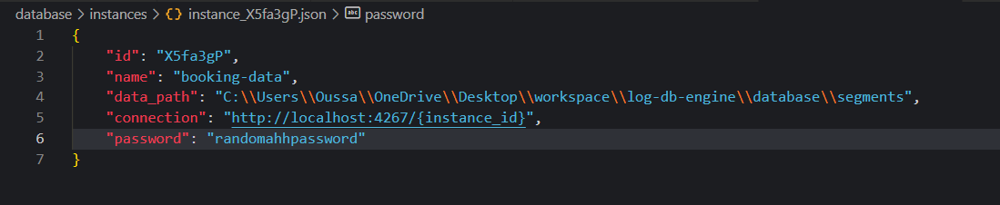

## Thinking Session - 8:40 AM - 02-04-2026

Alright let's think about how to implement the instances feature for this database engine.

first of all, we're gonna need some way to store the instances meta data, such as placement of data, instance name and general information, instance connection etc.

we should be thinking big, so the solution i should implement needs to support scale traffic.

here is a breakdown of everything we will need to implement for this:

* **instances storage:** a way to keep track of instances and their metadata (instance name, instance connection, instance data absolute path)
* **instances data storage:** i'll need a way to store data for each instance in a safe and easily accessible location, while still supporting scalability.
* **instances support on the interface:** i need to implement easy access to connect to an instance on the CLI

right off the bat, storing everything in one file (instances metadata) is not an option, so i'm thinking each instance would need its own JSON file, holding a name, created at timestamp, and a unique 7-digit identifier, and each instance will have its own directory in disk. so it should look like this:

why do it this way? the vibes.

currently it contains the necessary data in order to perform CRUD operations to the database, and to connect to it from the command line, along with a password for enhanced security (i should also add optional data encryption but that's for later). 

using the method, users can easily access their data and perform standard operations.

we're also going to need an index for instances, meaning that searching for an instance in the file system would be a O(n) operation. however, an index will increase memory usage which is already high with the current data hash index implementation. but for now, we'll assume that we have a lot of memory.
